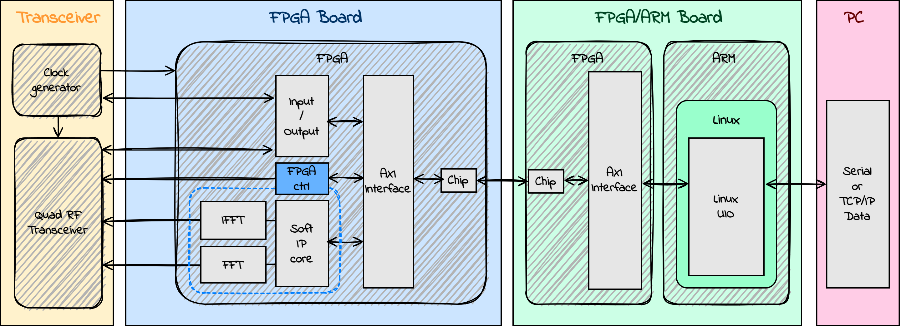

# next-gen-5g-router-fpga
next-gen-5g-router-fpga は、Latonaにおいて 開発中 の 次世代5Gルーター に関する情報を集めたレポジトリ です。  
本5Gルーターでは、FPGAを用いて5G通信基盤とLinuxとを回路接続して、家庭向けや商業用に AIを含めたリッチなアプリケーションを搭載した、Local-5Gと同等の高いコネクティビティと性能を実現します。    

## Latona が 開発中 の FPGAを用いた 次世代5Gルーター のアーキテクチャ　　
  

